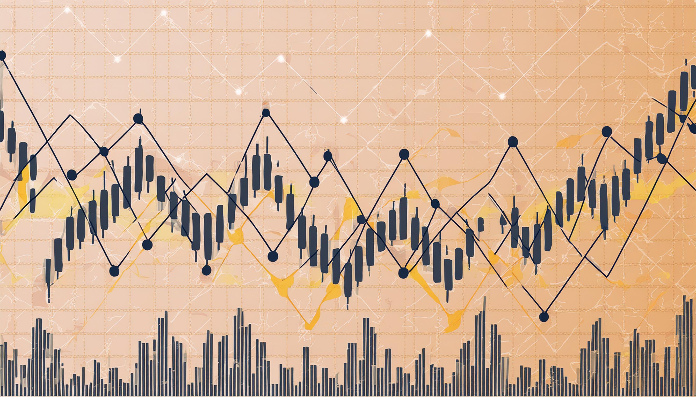

# My take on the role of Models and Greeks in Options trading

Author: Manu Jayadharan

## Introduction

In this post, I will discuss the pros and cons of financial modeling, specifically in the case of stock option pricing. I will talk about why I believe financial models are imperfect and less predictive compared to models derived from physical laws. I will provide the definition and usage of Greeks from the perspective of a mathematician and share my thoughts on their application. 

I have made several simplifications of concepts in this post to make the reading short and comprehensive. I am also talking about modelling of financial instruments and not algorithmic trading which is a different topic. 

This post is inspired by a similar post I wrote on Reddit on a related topic. This post can be found [here](https://www.reddit.com/r/options/comments/1dk4bc1/only_numbers_that_are_correct_about_an_option_are/?utm_source=share&utm_medium=web3x&utm_name=web3xcss&utm_term=1&utm_content=share_button).

## What are Options ? Can we model them perfectly ?

- __Role of Options:__ Options are perhaps the most powerul instrument in the trading world, offering the right, but not the obligation, to buy or sell an asset at a predetermined price, making them essential for both trading strategies and hedging risks. The asset or underlying of an option could be anything like stocks, bonds, commodities, etc. It gives the traders an "option" to buy or sell their securities under certain conditions. 

Since stock options are the most common type of options (at least from the perspective of mere mortals, aka retail traders like us), I will focus on discussing these options for the remainder of this discussion.

- __Modelling an option:__ To mathematically find the price of an option, we rely on mathematical models like Black-Scholes, which use complex formulas to estimate their value. However, let's not forget that these models, while incredibly useful, are still imperfect reflections of reality like every other model in the world. Models are our, mere humans', humble attempts to understand complex world around us using simplifications and assumptions. For options they may come in the form of probability distribution of stock price, constant volatility and interest rates, etc. 

## Can the model predict the future value of an option ? 

The short anwer is __NO!__

### The market is unpredictable!!

- This should come as no surprise since if the price of an option can be predicted like a phenomenon in physics, the world of finance won't be as interesting and exciting as it is. 
- The unpredictability of the stock market can be attributed to the indefinite number of factors that affect the price of a stock or its options. The factors include, but are not limited to, market sentiment, company performance, industry trends, interest rates, government policies, currency exchange rates, market liquidity, technological advancements, and natural disasters or climate events.

### If the market is not predictable, what is the best we can do ? 

We can do two things: 
1. __Model on assumptions__: We can make simplified assumptions about the market, such as the stock price following a specific type of stochastic process, some market factors remaining constant over short durations of time, and create a simple mathematical model of reality.
2. __Observe the market__: We can record transactions in the open market and utilize the prices at which traders are buying and selling stocks or any other related financial instruments.

### Model fitting eh ? 

__If you are a Scientist, and you have a model and some measurements what will you do ?__ 

- __Parameter estimation__: The natural approach would be to fit the model to the observed data. This is precisely what you could do in our example of option pricing models as well. We can use interest rates, prices, and volatility that are either observed directly in the market or inferred from other transactions to fit the parameters of your model, ensuring that your model gives a price that exactly matches the market price.  
- __Bootstrapping__: In the finance world, the process of parameter estimation, more accurately the market data estimation, from various types of observed data is called bootstrapping. You can bootstrap the interest rate curve, credit curve, volatility surface, etc., from  rates/prices quoted on the market.

## Physics laws vs Financial models
- __Physics__: In physics, we can create highly accurate models based on reasonable assumptions, and these models, often represented by differential equations, excel at predicting future states. There are often separations of scales which allow us to isolate a particular phenomenon or state from the influence of surrounding factors.

  

- __Finance__: Financial modeling, however, is a different beast. The models are inherently stochastic, and on top of that, we use a method called risk-neutral pricing for modeling financial derivatives. In simple terms, this approach assumes the market has perfect knowledge of an instrument's value and is always correct. However, the market is constantly changing and influenced by numerous interrelated factors, making the assumptions in financial modeling much more tenuous and the separation of scales impossible compared to those in physics.
- __Poor prediction__: Because of all the factors mentioned above, it is not surprising that the predictive capabilities of financial models are significantly less reliable than those of physical models.

## What good are financial models if they can't predict future ? 

The short answer is __Risk Management__. 

- __Risk sensitivities__: Financial models can be used to determine the risk sensitivities of various financial instruments. In the case of options, various Greeks (which we will introduce shortly) play an important role in understanding the sensitivity of the option price to various market factors such as stock price and interest rates.
- __Stress testing and scenario analysis__: Models are also used to assess worst-case scenarios and potential profits and losses during extreme events such as the 2008 financial crisis and COVID-19. In fact, most banks are federally required to conduct stress tests on their accounts using approved models and to monitor their risks accordingly.
-  __Other applications__: Models can also be used for other applications like fair value estimation of an instrument in the primary market, pricing non-liquid instruments, portfolio analysis etc. You can also run monte-carlo simulations to see if you could predict the future behaviour (Good luck with that!). 

#### Now it is time to talk about them Greeks!

## What are Greeks ? 

- The __Greeks__ of an option are it's price sensitivities to different market conditions. They are called greeks because as customary in mathematics, objects are denoted by greek letters and the people on wall street started calling them the greeks, probably because those are the only greek letters they see in their life. 

- Mathematically, if options are priced using a model (or a function), then Greeks are given by the rate of change of these functions with respect to various inputs of this model.
Greeks have the power to help traders and investors understand and manage the risks associated with their positions.

#### Types of Greeks

Popular and most useful Greeks are: __$\Delta$, $\Gamma$ $\Theta$, $\rho$, and $\nu$__. 
- $\Delta$: Delta measures how much an option's price is expected to move with a \$1 change in the underlying asset's price. 
- $\Gamma$: Gamma reveals how stable Delta is by showing its rate of change.
- $\Theta$: Theta, also known as the "time decay," tells us how much an option's price decreases as it nears expiration.
- $\rho$: Rho indicates how much the option's price will move with a 1% change in interest rates.
- $\nu$: Vega measures an option's sensitivity to changes in volatility, and Rho indicates how much the option's price will move with a 1% change in interest rates.

Together, these Greeks provide a way to understand the risk sensitivity of a large portfolio consisting of a large collection of financial instruments. 

### More precise definition

Consider an option (Call or Put) of a stock (for example TSLA) without paying dividends. Using some models like Black Scholes', the price of the option,$ P$, can be expressed as a function of some variables:

\$ P = f(S, K, T, \sigma, r, q) $

where:
- $S $ is the current stock price
- $ K $ is the strike price
- $ T $ is the time to expiration
- $ \sigma$ is the volatility of the stock
- $ r $ is the risk-free interest rate

Here's a table summarizing the key Greeks, along with their descriptions and definitions using partial derivatives of \( P \):

| Greek       | Short Description                                              | Definition                                      |
|-------------|----------------------------------------------------------------|-------------------------------------------------|
| Delta $\Delta$       | Sensitivity of the option price to changes in the stock price          | $\Delta = \frac{\partial P}{\partial S}$            |
| Gamma $\Gamma$       | Sensitivity of Delta to changes in the stock price                    | $\Gamma = \frac{\partial^2 P}{\partial S^2}$           |
| Theta $\Theta$      | Sensitivity of the option price to the passage of time                | $\Theta = -\frac{\partial P}{\partial T}$           |
| Vega $\nu$             | Sensitivity of the option price to changes in the volatility          | $\nu = \frac{\partial P}{\partial \sigma}$             |
| Rho $\rho$          | Sensitivity of the option price to changes in the risk-free interest rate | $\rho = \frac{\partial P}{\partial r}$             |

